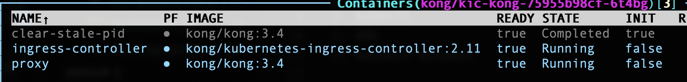
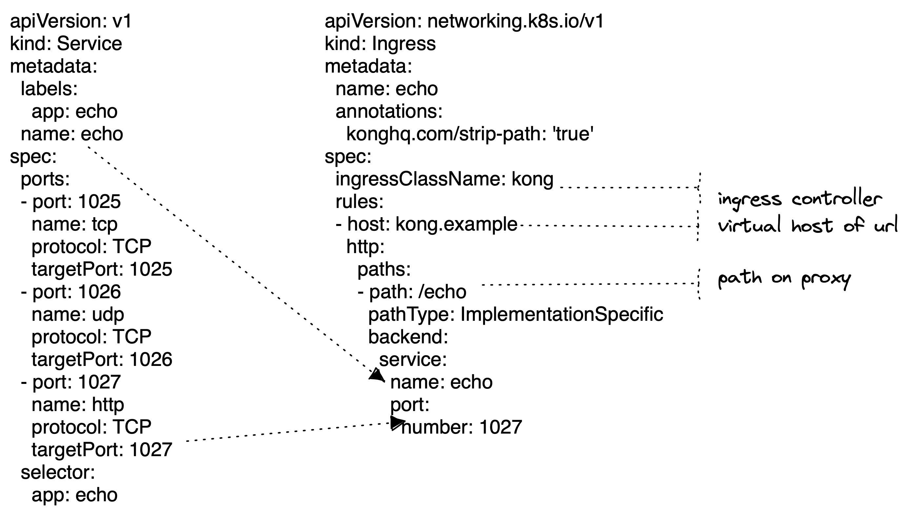

# Kong Deployment - Ingress Controller

This repo contains code and configuration for deploying Kong API Gateway using Ingress Controller

#### Pre-requisites

1. [minikube](https://minikube.sigs.k8s.io/docs/start/) or any k8s cluster
2. [helm](https://helm.sh/docs/helm/helm_install/)
3. [kubectl](https://kubernetes.io/docs/tasks/tools/)
4. [k9s](https://k9scli.io/topics/install/) (optional)
5. [konnect account](https://konghq.com/products/kong-konnect) (optional)

## KIC - Standalone

Start your minikube or k8s cluster and make sure you can run commands and verify connection to cluster

`kubectl get pods -A`

Create a namespace so that you can have all kong related objects grouped. 

`kubectl create namespace kong`

Lets start installing kong components. Follow the steps below, 

Add the kong helm chart,

`helm repo add kong https://charts.konghq.com`

Charts come with default values based on the published ones. You can also configure/customize the values for charts using a values.yaml file. For this installation I am using a values file [kic.yaml](./kic.yaml)

Install the chart with a release name `kic` under a namespace `kong` with customized values file. 

`helm install kic kong/kong -n kong -f kic.yaml`

You will see below pods have been created. The screenshot is from k9s which helps you to visualize the cluster and navigate quickly instead of running kubectl commands.



You can also check the status using, 

`kubectl get pods -n kong`

In order to test the kong gateway is up and running you need to expose the port outside the cluster. I will be using port-forward. You can replace the pod name from the output of above command. 

`kubectl port-forward kic-kong-75955b98cf-6t4bg -n kong 8000:8000`

Open a new shell prompt and run the curl command,

`curl -i http://localhost:8000`

Output

```
HTTP/1.1 404 Not Found
Content-Type: application/json; charset=utf-8
Connection: keep-alive
Content-Length: 52
X-Kong-Response-Latency: 0
Server: kong/3.4.0

{
  "message":"no Route matched with those values"
}
```

If you get 404 no route matched then the gateway is configured successfullly. This is beacuse you have not deployed any services or ingress. 

## KIC - Konnect

TODO

## Proxying services via Kong

Now that you have kong gateway up and running, you need to start deploying services in K8s cluster and expose them via Kong Ingress. 

[service.yaml](./service.yaml) is a predefined echo service which we can use to deploy and test the services running inside k8s cluster.

To deploy the service run the below command,

`kubectl apply -f service.yaml`

This would create a pod in the default namespace running on port 1027 (http). Check if the pod is running using the command,

`kubectl get pods`

Now comes the part where you need to define a route/ingress for this service to be exposed outside. 

[ingress.yaml](./ingress.yaml) is the specification which contains definition of how to expose the service via kong gateway. 

`kubectl apply -f ingress.yaml`

Below is the mapping of service to ingress,



With the service exposed on ingress, you can test the api using the below command,

`curl -i http://kong.example:8000/echo --resolve kong.example:8000:127.0.0.1`

Output
```
HTTP/1.1 200 OK
Content-Type: text/plain; charset=utf-8
Content-Length: 133
Connection: keep-alive
X-Kong-Upstream-Latency: 5
X-Kong-Proxy-Latency: 1
Via: kong/3.4.0

Welcome, you are connected to node minikube.
Running on Pod echo-7c8dd7d64-k9w22.
In namespace default.
With IP address 172.17.0.2
```

In order for you to proxy any external services running outside of your cluster, you can use the files [ext-service](./ext-service.yaml) and [ext-ingress](./ext-ingress.yaml)

Create these objects in your cluster using the below commands,

`kubectl apply -f ext-service.yaml`

`kubectl apply -f ext-ingress.yaml`

Test the url and you should see the response from httpbin service,

`curl -i http://kong.example:8000/httpbin/anything --resolve kong.example:8000:127.0.0.1`

Output
```
HTTP/1.1 200 OK
Content-Type: application/json
Content-Length: 482
Connection: keep-alive
Server: gunicorn/19.9.0
Access-Control-Allow-Origin: *
Access-Control-Allow-Credentials: true
X-Kong-Upstream-Latency: 510
X-Kong-Proxy-Latency: 2
Via: kong/3.4.0

{
  "args": {}, 
  "data": "", 
  "files": {}, 
  "form": {}, 
  "headers": {
    "Accept": "*/*", 
    "Host": "kong.example", 
    "User-Agent": "curl/7.86.0", 
    "X-Amzn-Trace-Id": "Root=1-6503f82b-6412279a702c96dd301ea656", 
    "X-Forwarded-Host": "kong.example", 
    "X-Forwarded-Path": "/httpbin/anything", 
    "X-Forwarded-Prefix": "/httpbin"
  }, 
  "json": null,
  "method": "GET", 
  "origin": "127.0.0.1, 49.207.192.144", 
  "url": "http://kong.example/anything"
}
```

Power of Kong Gateway can be seen with the latency experienced when it passes through Ingress. Note the `X-Kong-Proxy-Latency` values in the output. 

## Switching to Enterprise

In order to use the enterprise capabilities of Kong like advanced plugins and others, you need to add the license as secret and add the secret name to [values.yaml](./kic-enterprise.yaml)

`kubectl create secret generic kong-enterprise-license --from-file=license=./license.json`

[values.yaml](./kic-full.yaml) has the complete setup including kong manager, dev portal, postgres DB with enterprise license which is typical deployment for your enterprise. 

You can refer the [Kong Charts](https://github.com/Kong/charts/blob/main/charts/kong/values.yaml) for complete list of values that can be used with charts. 

## Quickstart Guide

[quickstart](./quickstart.sh) file has the commands needed to bring up the deployments. Its good practice to follow along by running each command separately. You can also run the shell script to get you started quickly.

[cleanup](./cleanup.sh) file has commands to delete the resources created

[preinstall](./preinstall.sh) file has commands which are required for enterprise full capabilities.
